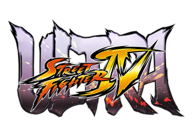
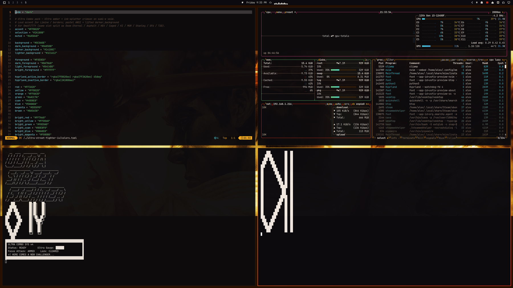
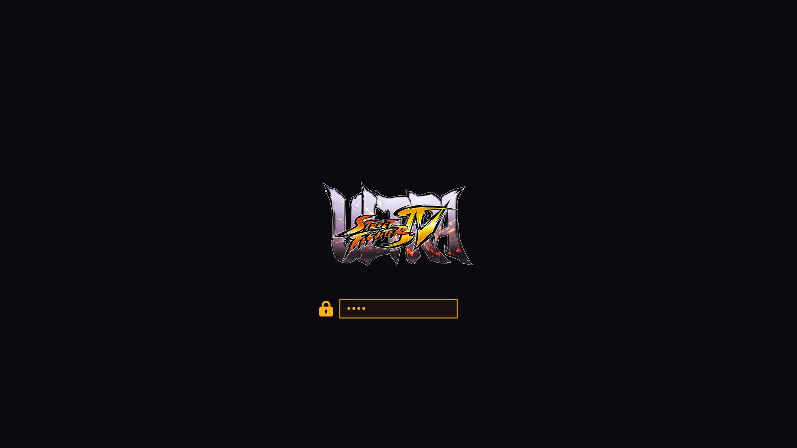

# Ultra Street Fighter IV — Omarchy theme

Remember Focus Attack? Ultra Gauge filling while the ink-splash hits land?
Hopefully you’re still in the lab — natural extension for your hypr system,
aren’t fighting games how we all got here anyway? What if your desktop matched
Capcom’s *Ultra Street Fighter IV* **Ultra amber → ink-splatter crimson** on a
sumi-e void instead of another flat dark mode? Same dual-accent border trick as
Asphalt, HEV, Galuga, CS, Cyber Shadow, Doom 2016, Eternal, Caged, KI, Rising,
Stanley, SF6 & T2D — different arcade.

Fighting-game theme for [Omarchy](https://omarchy.org/). Inspired by the look of
*Ultra Street Fighter IV* — **not affiliated with Capcom** (see
[Credits](#credits--legal-ish) below).

No Omarchy pack turned up. HyperSpin / Steam Grid “USFIV” skins are logo-heavy
frontends, not a Hyprland palette. Windows / Rainmeter SF packs don’t hand you
colors.toml. Built from Steam store / library art and Wallhaven key art the same
way as
[Asphalt Legends](https://github.com/AlxWolfenstein97/omarchy-asphalt-legends-theme),
[HEV Suit](https://github.com/AlxWolfenstein97/omarchy-hev-suit-theme),
[Operation Galuga](https://github.com/AlxWolfenstein97/omarchy-operation-galuga-theme),
[Counter-Strike](https://github.com/AlxWolfenstein97/omarchy-counter-strike-theme),
[Cyber Shadow](https://github.com/AlxWolfenstein97/omarchy-cyber-shadow-theme),
[Doom 2016](https://github.com/AlxWolfenstein97/omarchy-doom-2016-theme),
[Doom Eternal](https://github.com/AlxWolfenstein97/omarchy-doom-eternal-theme),
[Half-Life Caged](https://github.com/AlxWolfenstein97/omarchy-half-life-caged-theme),
[Killer Instinct](https://github.com/AlxWolfenstein97/omarchy-killer-instinct-theme),
[Metal Gear Rising](https://github.com/AlxWolfenstein97/omarchy-metal-gear-rising-theme),
[Stanley Parable](https://github.com/AlxWolfenstein97/omarchy-stanley-parable-theme),
[Street Fighter 6](https://github.com/AlxWolfenstein97/omarchy-street-fighter-6-theme),
and
[Terminator 2D: NO FATE](https://github.com/AlxWolfenstein97/omarchy-terminator-2d-no-fate-theme).

<p align="center">
  
</p>





## Install

```bash
omarchy theme install https://github.com/AlxWolfenstein97/omarchy-ultra-street-fighter-iv-theme.git
# optional — About + screensaver ASCII for this theme (skippable; see Branding)
cp ~/.config/omarchy/themes/ultra-street-fighter-iv/about.txt ~/.config/omarchy/branding/about.txt
cp ~/.config/omarchy/themes/ultra-street-fighter-iv/screensaver.txt ~/.config/omarchy/branding/screensaver.txt
```

That clones **and** applies the theme (`omarchy-theme-set` runs inside
`theme install`). Do **not** follow with another `omarchy theme set` — a second
set skips the first wallpaper and just wastes a switch.

Or clone into place (then you *do* need an explicit set):

```bash
git clone https://github.com/AlxWolfenstein97/omarchy-ultra-street-fighter-iv-theme.git ~/.config/omarchy/themes/ultra-street-fighter-iv
omarchy theme set "Ultra Street Fighter Iv"
# optional branding — same as above
cp ~/.config/omarchy/themes/ultra-street-fighter-iv/about.txt ~/.config/omarchy/branding/about.txt
cp ~/.config/omarchy/themes/ultra-street-fighter-iv/screensaver.txt ~/.config/omarchy/branding/screensaver.txt
```

Already installed and just switching back later:

```bash
omarchy theme set "Ultra Street Fighter Iv"
# optional — re-apply this theme’s About / screensaver marks
cp ~/.config/omarchy/themes/ultra-street-fighter-iv/about.txt ~/.config/omarchy/branding/about.txt
cp ~/.config/omarchy/themes/ultra-street-fighter-iv/screensaver.txt ~/.config/omarchy/branding/screensaver.txt
```

Cycle wallpapers with `omarchy theme bg next`.

## What’s in the pack

| Asset | Role |
|-------|------|
| `colors.toml` | Palette (the real theme) |
| `backgrounds/` | HUD-less / logo-free wallpapers |
| `unlock.png` / `preview-unlock.png` | Plymouth unlock + picker mockup |
| `preview.png` | Theme switcher preview |
| `icon.txt` / `logo.txt` (+ `about.txt` / `screensaver.txt`) | About & screensaver **ASCII** branding |
| `icon.png` / `logo.png` | Same marks as images (README + optional “Set From Image”) |

### Branding (About / screensaver)

**Optional.** Omarchy’s About screen and screensaver read from
`~/.config/omarchy/branding/`. Shipping per-theme `.txt` marks isn’t original —
other Omarchy 3.x themes did it — but it’s the fast path if you want *this*
pack’s wordmark on idle and on About without hunting files.

**Prefer the `.txt` files** and the `cp` lines in [Install](#install). That’s
what you’re meant to see. Editing the text also works (Style → About /
Screensaver → Edit Text).

**Skip the `cp` if you already have custom logos / screensaver art you care
about** — or back those up first. The branding slot is really meant for *your*
marks (put personal art somewhere easy to reach). The Style file picker works,
but drilling into `~/.config/omarchy/themes/...` is slow busywork for something
optional. Don’t feel obliged to bring mine.

The `.png` versions are here for the README and for a quick Style → **Set From
Image** try. In my experience Omarchy’s image→ASCII path is a bit thinicky on
color and boxing, so don’t expect magic from the PNGs — the hand text is the
good path.

Screensaver / logo ASCII is a dense **ULTRA STREET FIGHTER IV** wordmark plus an
Ultra Combo status panel (no empty lines). About / icon is a spiked **IV**
monogram (same silhouette DNA as the stencil logo, no empty lines).

### Unlock

Style → Unlock → pick this theme (`unlock.png` / `preview-unlock.png`).

## Extend further with plugins

This repo is **palette + assets** on purpose. Omarchy already colour-coordinates
the shell, terminals, and editor from `colors.toml`. The plugins below push that
idea as far as it can reasonably go — optional extenders, not required theme
baggage. Themes keep working without them; authors can stick to the snappier
stock pipeline if they prefer.

They do **not** depend on each other. Pick what you want; run the whole
inch-a-lada if you want the desktop to feel like yours.

### The big sweep

| Plugin | What it themes |
|--------|----------------|
| **[Chroma](https://github.com/AlxWolfenstein97/chroma)** | GTK3 / GTK4 / libadwaita + Qt |
| **[OmaOBS](https://github.com/AlxWolfenstein97/omaobs)** | OBS Studio (real Yami `Omarchy.ovt`) |
| **[OmaCursor](https://github.com/AlxWolfenstein97/omacursor)** | Pointer / Adwaita XCursor recolor (+ optional SDDM) |
| **[OmaHud](https://github.com/AlxWolfenstein97/omahud)** | MangoHud colours only — live in-game retint |
| **[OmaBoot](https://github.com/AlxWolfenstein97/omaboot)** | Limine boot menu colours |
| **[OmaVT](https://github.com/AlxWolfenstein97/omavt)** | Virtual console / TTY palette |
| **[OmaTTY](https://github.com/AlxWolfenstein97/omatty)** | Console font (Terminus-first, accessibility) |

**Boom-in — one paste.** `--enable --yes` skips the per-plugin clone/enable
prompts; arm-all then arms deps + Style/theme-set + root/SDDM/DRM (no Y/n).
Omit any `plugin add` line you do not want; arm-all only touches what is
installed. Sudo may ask once — that is the boom, not a menu.

```bash
omarchy plugin add https://github.com/AlxWolfenstein97/chroma.git --enable --yes
omarchy plugin add https://github.com/AlxWolfenstein97/omaobs.git --enable --yes
omarchy plugin add https://github.com/AlxWolfenstein97/omacursor.git --enable --yes
omarchy plugin add https://github.com/AlxWolfenstein97/omahud.git --enable --yes
omarchy plugin add https://github.com/AlxWolfenstein97/omaboot.git --enable --yes
omarchy plugin add https://github.com/AlxWolfenstein97/omavt.git --enable --yes
omarchy plugin add https://github.com/AlxWolfenstein97/omatty.git --enable --yes
~/.config/omarchy/plugins/io.github.alxwolfenstein97.chroma/tools/arm-all-family.sh
```

**Boom-out — one paste.** Mirror: teardown + pkg drop best-effort + plugin remove.

```bash
~/.config/omarchy/plugins/io.github.alxwolfenstein97.chroma/tools/wipe-all-family.sh
```

**Piece-meal** (not boom): one plugin’s Workshop paste — `plugin add` + interactive
`install.sh` (asks [Y/n]) — lives on that plugin’s GitHub README. Single-plugin
full wipe: `…/<plugin>/uninstall.sh --yes`.

### Already solved elsewhere (gladly)

- **[Omacord](https://github.com/ASwenia/omacord)** — Vesktop / Vencord Discord
  follows Omarchy themes live:  
  `omarchy plugin add https://github.com/ASwenia/omacord --enable`

### Agent / desktop bridge

- **[OMCP](https://github.com/btsouth/omarchy-omcp)** — MCP desktop bridge:  
  `omarchy plugin add https://github.com/btsouth/omarchy-omcp --enable`

Browse more on the [Omarchy Plugins](https://plugins.omarchy.org/) site.

## Taste

Colours and contrast are tuned for what I like to look at. If they feel loud or
wrong for you, fork and retune `colors.toml` without guilt.

## Credits / legal-ish

- Visual inspiration and reference art from **Capcom**’s *Ultra Street Fighter IV*
  branding and marketing (Steam library hero / logo, HUD-less Steam store
  screenshots). **Not affiliated with, endorsed by, or sponsored by Capcom.**
  Just public pixels arranged into an Omarchy theme — no money, no official
  product.
- Wallhaven IDs used for key art: `0qkrml`, `eojgjw`, `8gg6eo`.
- Steam store shots kept (Rolento jungle, Poison/Makoto ship, Hugo/Guy street,
  Decapre lab, Blanka/Abel factory, Ryu/Ken hadoken, Dan/Fei Long elevator,
  Sagat/Balrog Jurassic, Ibuki/Decapre skate park, Cody/Honda hangar,
  Bison/Ken lanterns) and the library-hero pad were checked for HUD, title
  overlays, and Ultra-era roster/stage fit before shipping — logo-bearing
  Wallhaven comps (`49rvjd`), SNES collage (`492g5k`), unrelated “hardcore
  gamer IQ” collage (`nkz9qd`), plus Wallhaven IDs that weren’t Ultra-era
  key art (`0jzoky`, `4yprgk`, `4yprgg`, `0pdxje`, `4gel9d`) and one Steam
  store shot that didn’t belong (`ss` market pair) were dropped on purpose.
- If Capcom hates this existing, they can say so and I’ll deal with the repo
  accordingly.

## License

Do whatever you want with this theme pack unless Capcom (or the law) says
otherwise. Fork it, recolor it, ship it in a rice. No warranty — it’s wallpaper
and hex codes.
